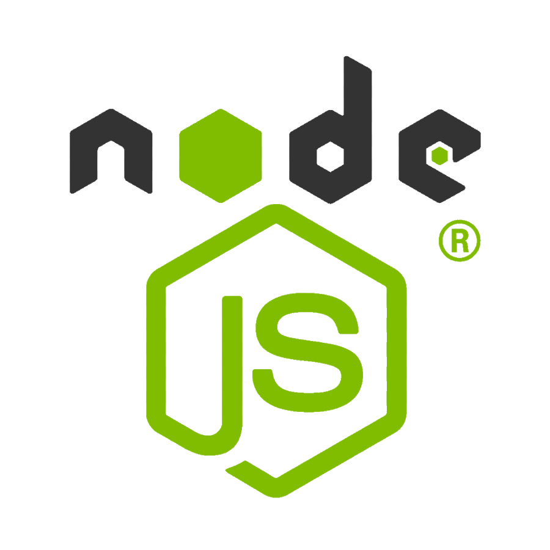
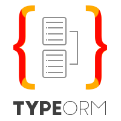

### Thayron Feitosa 👋

Learning day by day and helping devs. Enthusiast of technology and lover of React & NodeJS stack.

- 🔭 I’m currently working on developer team Soluti certificação digital 💚
- 🌱 I’m currently learning NodeJS, ReactJS, React Native, Typescript, and Jest;
- 💬 Ask me about technology, series and games;
- 📫 How to reach me: The badges will help you 😉

 

 <h3 align="center" >Languages and Tools:</h3> 

----

 

----

<!--
**danilo-vieira/danilo-vieira** is a ✨ _special_ ✨ repository because its `README.md` (this file) appears on your GitHub profile.
https://camo.githubusercontent.com/c622b50a943e3aaed5eacb6ef8add49b4eca3e1748c5baabadb017618b61ef50/68747470733a2f2f666972656261736573746f726167652e676f6f676c65617069732e636f6d2f76302f622f726573756d652d37643930362e61707073706f742e636f6d2f6f2f6e6f64656a732d696d6167652e706e673f616c743d6d6564696126746f6b656e3d39333935663336332d393638612d343632372d623637352d313136363430386235626632
- 😄 Pronouns: ...
- ⚡ Fun fact: ...
- 👯 I’m looking to collaborate on ...
- 🤔 I’m looking for help with ...

<!--
**thayronFeitosa/thayronFeitosa** is a ✨ _special_ ✨ repository because its `README.md` (this file) appears on your GitHub profile.

Here are some ideas to get you started:

- 🔭 I’m currently working on ...
- 🌱 I’m currently learning ...
- 👯 I’m looking to collaborate on ...
- 🤔 I’m looking for help with ...
- 💬 Ask me about ...
- 📫 How to reach me: ...
- 😄 Pronouns: ...
- ⚡ Fun fact: ...
-->
